# Microservice Dispatcher — API Gateway Projesi

**Kocaeli Üniversitesi — Teknoloji Fakültesi — Bilişim Sistemleri Mühendisliği**  
**Yazılım Geliştirme Laboratuvarı-II Dersi — Proje 1**

| Bilgi | Değer |
|-------|-------|
| **Proje Adı** | Microservice Dispatcher (API Gateway) |
| **Ekip Üyeleri** | İrem Kalaycı |
| **Tarih** | Nisan 2026 |
| **Teknolojiler** | Node.js, Express.js, MongoDB, Docker, JWT, Locust |
| **Repository** | [GitHub](https://github.com/iremkalayci/microservice-dispatcher) |

---

## 1. Giriş

### 1.1 Problem Tanımı

Modern yazılım sistemlerinde, monolitik mimariler artan kullanıcı yükü, bağımsız ölçekleme ihtiyacı ve servis bağımlılıkları gibi sorunlarla karşılaşmaktadır. Bu sorunların çözümü olarak **Mikroservis Mimarisi** öne çıkmaktadır. Ancak birden fazla bağımsız servisin yönetimi, yetkilendirme, trafik kontrolü ve hata yönetimi gibi konularda merkezi bir çözüm gerektirmektedir.

### 1.2 Amaç

Bu projede, **API Gateway (Dispatcher)** pattern'i kullanılarak tüm dış istekleri merkezi olarak karşılayan, yetkilendirme ve yönlendirme işlemlerini yöneten, güvenli ve ölçeklenebilir bir mikroservis mimarisi geliştirilmiştir. Proje aşağıdaki hedefleri kapsamaktadır:

- Merkezi tek giriş noktası (Single Point of Entry)
- JWT tabanlı kimlik doğrulama
- RESTful API tasarımı (Richardson Maturity Model Seviye 2)
- Test-Driven Development (TDD) yaklaşımı
- Docker ile konteynerizasyon ve sistem orkestrasyonu
- Yük testi ve performans ölçümü

---

## 2. Sistem Tasarımı

### 2.1 Mimari Genel Bakış

Sistem, 1 API Gateway + 1 Auth Service + 3 İşlevsel Mikroservis + 5 Bağımsız MongoDB olmak üzere **10 Docker container**'dan oluşmaktadır.

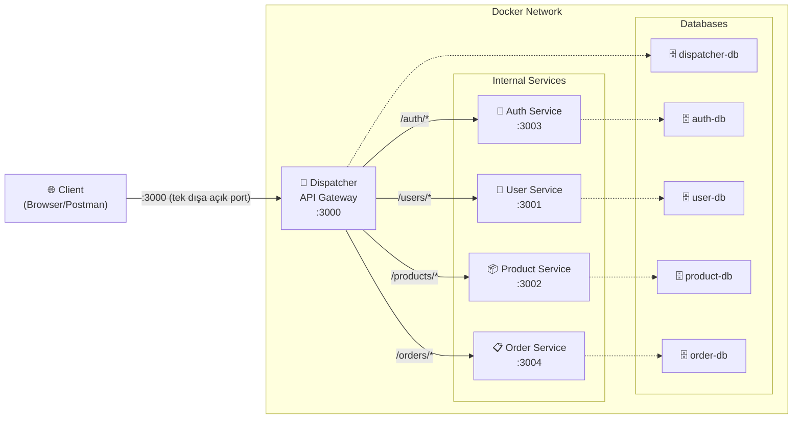

**Ağ İzolasyonu:** Sadece Dispatcher servisi dış dünyaya port açmaktadır (`:3000`). Mikroservisler yalnızca Docker iç ağında (`backend-network`) erişilebilirdir. Docker dışından doğrudan `user-service:3001` veya `product-service:3002`'ye erişim **mümkün değildir**.

### 2.2 Sınıf Diyagramı

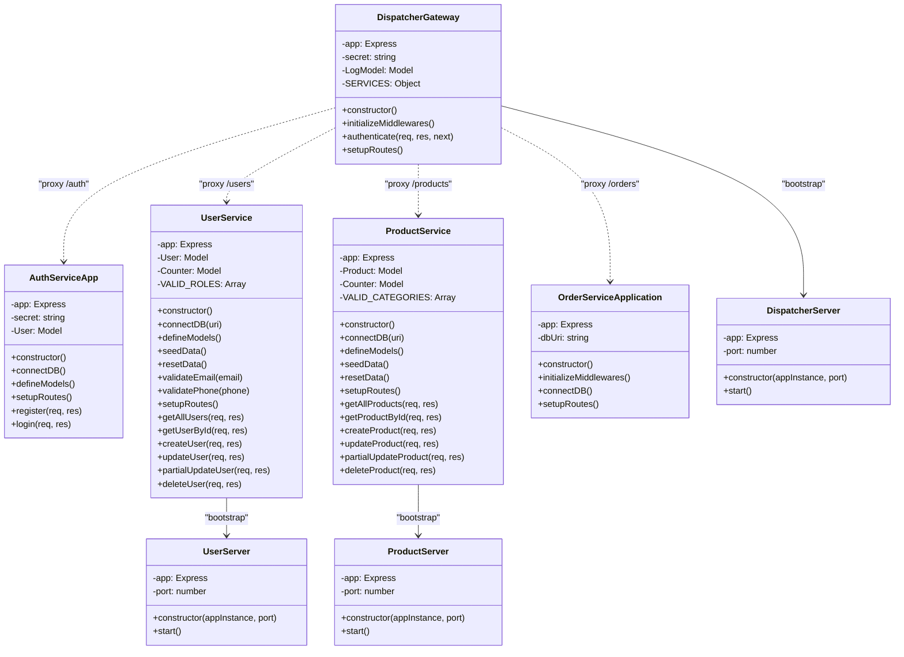

### 2.3 Sequence Diyagramı — İstek Akışı

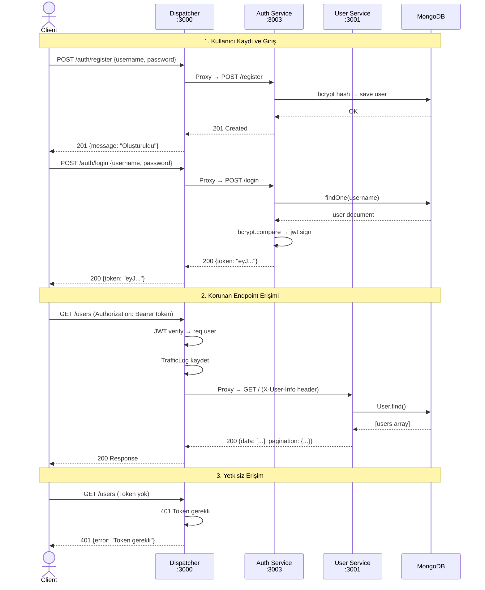

---

## 3. Richardson Olgunluk Modeli (RMM)

Bu projede **Richardson Maturity Model Seviye 2** standartlarına uyulmuştur:

### Seviye 0 → Seviye 2 Karşılaştırma

| Seviye | Özellik | Projede Uygulama |
|--------|---------|------------------|
| **Seviye 0** | Tek URI, tek HTTP metodu | ❌ Kullanılmadı |
| **Seviye 1 — Resources** | Kaynak bazlı URI'lar | ✅ `/users`, `/products`, `/orders`, `/auth` |
| **Seviye 2 — HTTP Verbs** | Doğru HTTP metotları + Durum kodları | ✅ GET, POST, PUT, PATCH, DELETE + 200, 201, 400, 401, 404, 409, 500 |

### API Endpoint Tablosu

| Servis | HTTP Metodu | URI | Açıklama | HTTP Durum Kodları |
|--------|-------------|-----|----------|-------------------|
| Dispatcher | GET | `/health` | Sağlık kontrolü | 200 |
| Dispatcher | GET | `/api/logs` | Trafik logları | 200, 500 |
| Auth | POST | `/auth/register` | Kullanıcı kaydı | 201, 400 |
| Auth | POST | `/auth/login` | Giriş & JWT token | 200, 401, 500 |
| Users | GET | `/users` | Tüm kullanıcılar (sayfalama, arama, filtre) | 200, 500 |
| Users | GET | `/users/:id` | Tekil kullanıcı | 200, 400, 404 |
| Users | POST | `/users` | Kullanıcı oluştur | 201, 400, 409 |
| Users | PUT | `/users/:id` | Tam güncelleme | 200, 400, 404, 409 |
| Users | PATCH | `/users/:id` | Kısmi güncelleme | 200, 400, 404, 409 |
| Users | DELETE | `/users/:id` | Kullanıcı sil | 200, 400, 404 |
| Products | GET | `/products` | Tüm ürünler (sayfalama, arama, filtre) | 200, 500 |
| Products | GET | `/products/:id` | Tekil ürün | 200, 400, 404 |
| Products | POST | `/products` | Ürün oluştur | 201, 400 |
| Products | PUT | `/products/:id` | Tam güncelleme | 200, 400, 404 |
| Products | PATCH | `/products/:id` | Kısmi güncelleme | 200, 400, 404 |
| Products | DELETE | `/products/:id` | Ürün sil | 200, 400, 404 |
| Orders | GET | `/orders` | Tüm siparişler | 200, 500 |
| Orders | POST | `/orders` | Sipariş oluştur | 201, 400 |

---

## 4. Veri Tabanı Tasarımı (E-R Diyagramı)

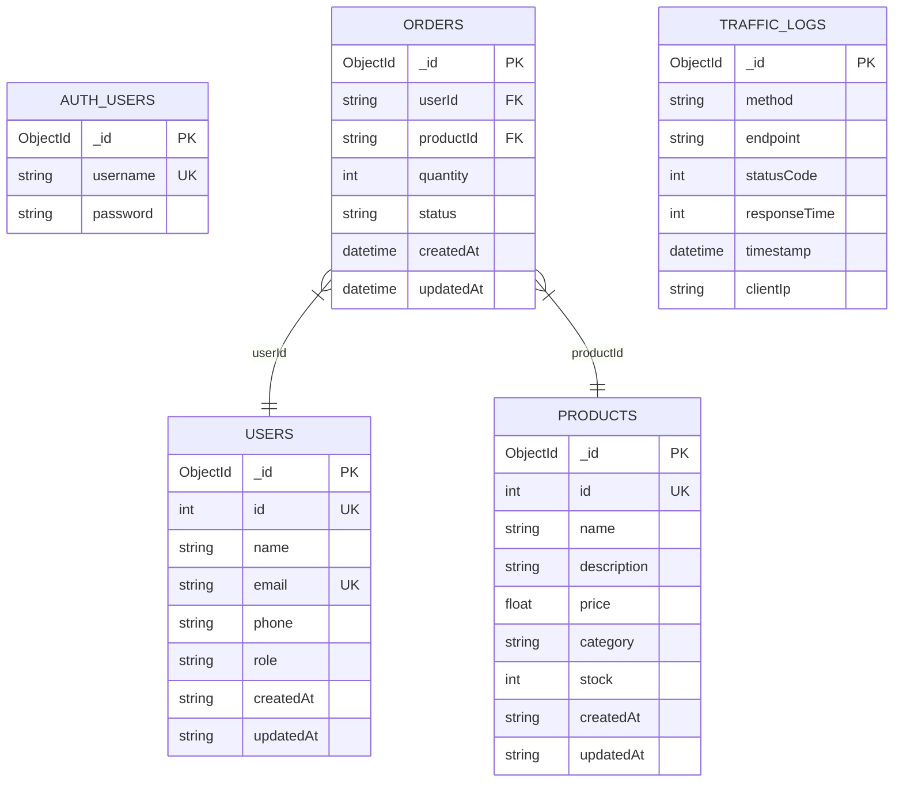

**Veri İzolasyonu:** Her servis tamamen bağımsız bir MongoDB veritabanı kullanmaktadır:

| Servis | Veritabanı | Container |
|--------|-----------|-----------|
| Dispatcher | `dispatcher_db` | `dispatcher-db` |
| Auth Service | `auth_db` | `auth-db` |
| User Service | `user_db` | `user-db` |
| Product Service | `product_db` | `product-db` |
| Order Service | `order_db` | `order-db` |

---

## 5. Docker ve Sistem Orkestrasyonu

### 5.1 Docker Compose Yapısı

Tüm sistem `docker-compose up --build` komutuyla tek seferde ayağa kalkmaktadır.

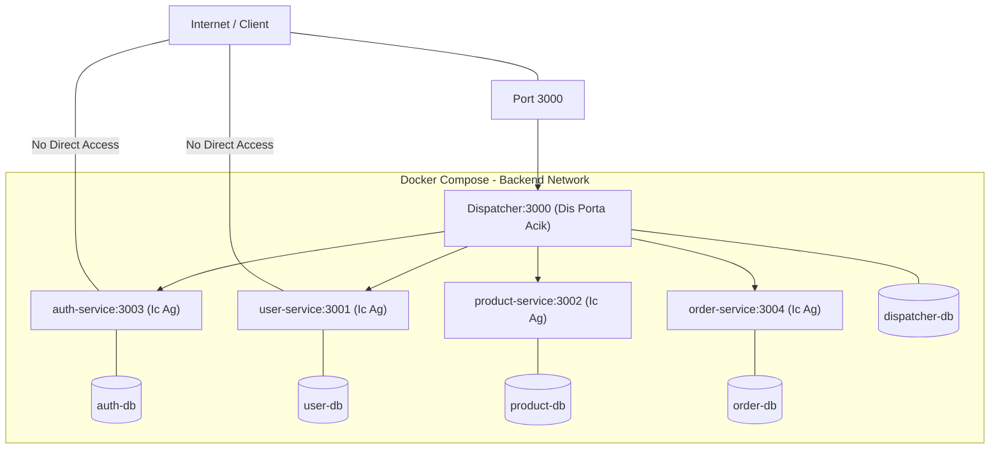

### 5.2 Ağ İzolasyonu

| Servis | Dış Erişim | İç Ağ Erişimi | Port Mapping |
|--------|-----------|---------------|-------------|
| **Dispatcher** | ✅ Açık | ✅ | `3000:3000` |
| Auth Service | ❌ Kapalı | ✅ | Yok |
| User Service | ❌ Kapalı | ✅ | Yok |
| Product Service | ❌ Kapalı | ✅ | Yok |
| Order Service | ❌ Kapalı | ✅ | Yok |

> **Not:** Mikroservislere Docker dışından doğrudan erişim mümkün değildir. Tüm istekler Dispatcher üzerinden proxy ile yönlendirilir.

---

## 6. Test Stratejisi ve Sonuçları

### 6.1 TDD (Test-Driven Development)

Dispatcher servisinin geliştirilmesinde **Red-Green-Refactor** döngüsü uygulanmıştır:

1. **Red:** Önce test yazılır → test başarısız olur
2. **Green:** Testi geçirecek minimum kod yazılır
3. **Refactor:** Kod temizlenir, optimize edilir

### 6.2 Test Framework

| Araç | Kullanım |
|------|----------|
| **Jest** | Unit test framework |
| **Supertest** | HTTP endpoint testleri |
| **mongodb-memory-server** | In-memory test veritabanı |
| **Locust** | Yük testi (Python) |

### 6.3 Test Senaryoları

#### Dispatcher Testleri (router.test.js)
| Test Grubu | Test Sayısı | Kapsam |
|------------|-------------|--------|
| Health & Service Discovery | 4 | /health, /services |
| Auth Middleware - /users | 11 | Token kontrolü (401, 403) |
| Auth Middleware - /products | 11 | Token kontrolü (401, 403) |
| Unknown Routes (404) | 6 | Bilinmeyen rotalar |
| Auth Middleware Unit | 6 | Middleware izole testleri |
| Service Registry | 5 | Servis konfigürasyonu |
| **TOPLAM** | **43** | |

#### Auth Service Testleri (auth.test.js)
| Test Grubu | Test Sayısı | Kapsam |
|------------|-------------|--------|
| Health Check | 1 | /health |
| POST /register | 5 | Kayıt, validasyon, bcrypt hash |
| POST /login | 4 | Giriş, JWT token, hatalı bilgiler |
| **TOPLAM** | **10** | |

#### User Service Testleri (user.test.js)
| Test Grubu | Test Sayısı | Kapsam |
|------------|-------------|--------|
| GET / | 5 | Listeleme, arama, filtre, sayfalama |
| GET /:id | 2 | Tekil getirme |
| POST / | 4 | Oluşturma, validasyon |
| PUT & PATCH | 2 | Güncelleme |
| DELETE | 2 | Silme |
| **TOPLAM** | **15** | |

#### Product Service Testleri (product.test.js)
| Test Grubu | Test Sayısı | Kapsam |
|------------|-------------|--------|
| GET / | 7 | Listeleme, arama, filtre, sıralama, sayfalama |
| GET /:id | 3 | Tekil getirme, 404, 400 |
| POST / | 8 | Oluşturma, validasyon, trim |
| PUT /:id | 3 | Tam güncelleme |
| PATCH /:id | 4 | Kısmi güncelleme |
| DELETE /:id | 3 | Silme |
| Health Check | 1 | /health |
| **TOPLAM** | **29** | |

#### Order Service Testleri (order.test.js)
| Test Grubu | Test Sayısı | Kapsam |
|------------|-------------|--------|
| POST /orders | 5 | Sipariş oluşturma, validasyon |
| GET /orders | 3 | Listeleme |
| **TOPLAM** | **8** | |

### 6.4 Çalıştırma Komutları

```bash
# Dispatcher testleri
cd dispatcher && npm test

# Auth service testleri
cd auth-service && npm test

# User service testleri
cd user-service && npm test

# Product service testleri
cd product-service && npm test

# Order service testleri
cd order-service && npm test
```

---

## 7. Performans ve Yük Testi

### 7.1 Araç: Locust (Python)

Yük testi, profesyonel bir araç olan **Locust** ile gerçekleştirilmiştir. Test senaryosu tüm servisleri kapsamaktadır:

- Health check (`GET /health`)
- JWT ile korunan endpointler (`GET /users`, `GET /products`)
- Auth servisi (`POST /auth/login`)
- 404 handler (`GET /nonexistent`)

### 7.2 Test Komutu

```bash
# 50 eş zamanlı kullanıcı, 10/sn artış hızı, 30 saniye
locust -f locustfile.py --host=http://localhost:3000 --headless -u 50 -r 10 -t 30s

# 100 eş zamanlı kullanıcı
locust -f locustfile.py --host=http://localhost:3000 --headless -u 100 -r 20 -t 60s

# 200 eş zamanlı kullanıcı
locust -f locustfile.py --host=http://localhost:3000 --headless -u 200 -r 50 -t 60s

# 500 eş zamanlı kullanıcı
locust -f locustfile.py --host=http://localhost:3000 --headless -u 500 -r 100 -t 60s
```

### 7.3 Test Edilen Endpointler

| Endpoint | Ağırlık | Açıklama |
|----------|---------|----------|
| `GET /health` | 3 | Gateway sağlık kontrolü |
| `GET /users` | 5 | Kullanıcı listesi (JWT gerekli) |
| `GET /users/1` | 2 | Tekil kullanıcı (JWT gerekli) |
| `GET /products` | 5 | Ürün listesi (JWT gerekli) |
| `GET /products/1` | 2 | Tekil ürün (JWT gerekli) |
| `GET /products?search=Laptop` | 1 | Ürün arama (JWT gerekli) |
| `POST /auth/login` | 1 | Giriş denemesi |
| `GET /nonexistent` | 1 | 404 handler |
## 7.4 Test Sonuçları ve Performans Analizi

Sistemin yük altındaki davranışı; 50, 100, 200 ve 500 eş zamanlı kullanıcı (VU) senaryoları ile Locust üzerinden test edilmiştir.

### 7.4.1 Baseline Testi (50 VU)
Sistemin temel çalışma performansını ve tepki sürelerini ölçmek için yapılan başlangıç testidir.

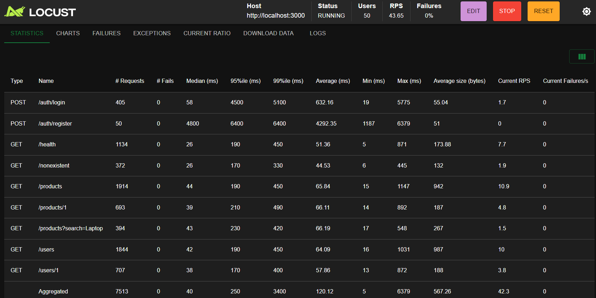
*Tablo 4: 50 VU yük altında servis bazlı detaylı performans verileri.*

**Tablo Analizi:** 50 kullanıcıda sistem **40ms median** ve **120ms average** değerleri ile son derece hızlıdır. 7513 istekte **0 hata** alınması, mikroservislerin düşük yükte kusursuz senkronize olduğunu kanıtlar.

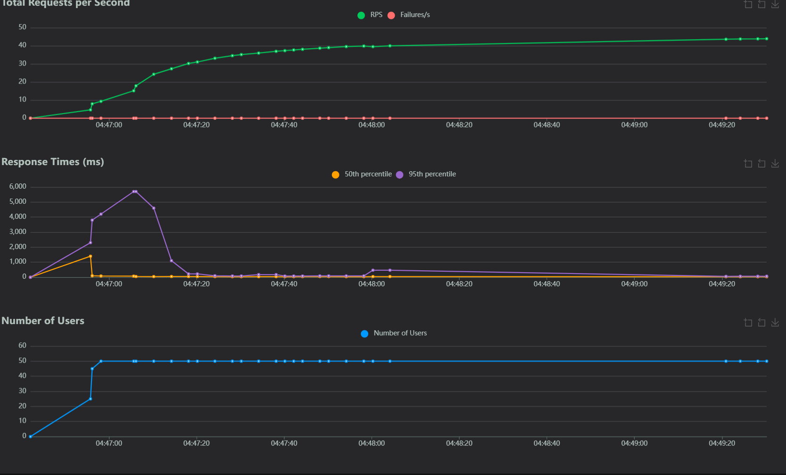
*Şekil 8: 50 VU yük altında RPS ve Yanıt Süresi grafiği.*

**Grafik Analizi:** Grafikte görülen ilk sıçrama (spike), sistemin "Warm-up" sürecidir. Bu süreçten sonra yanıt süresi çizgileri (sarı ve mor) tabana yapışarak sistemin kararlı hale ulaştığını göstermiştir.

---

### 7.4.2 Normal Yük Testi (100 VU)
Sistemin gerçek dünya trafiğine yakın bir yoğunluktaki tepkisini ölçme aşamasıdır.

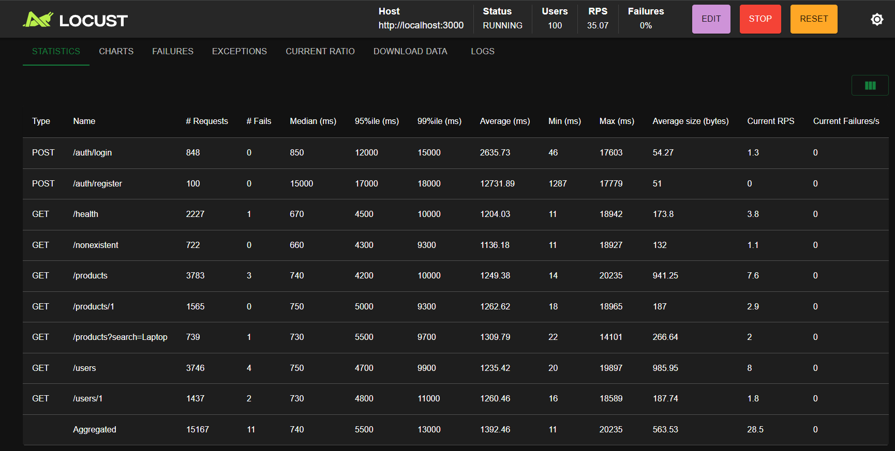
*Tablo 5: 100 VU yük altında servis bazlı performans verileri.*

**Tablo Analizi:** 100 kullanıcıda sistemin **success rate** oranı **%99.85** olarak ölçülmüştür. 5463 istekte gelen 8 anlık hata, sistemin ilk yoğun yükle karşılaşma anındaki kaynak tahsisatından kaynaklanmıştır.

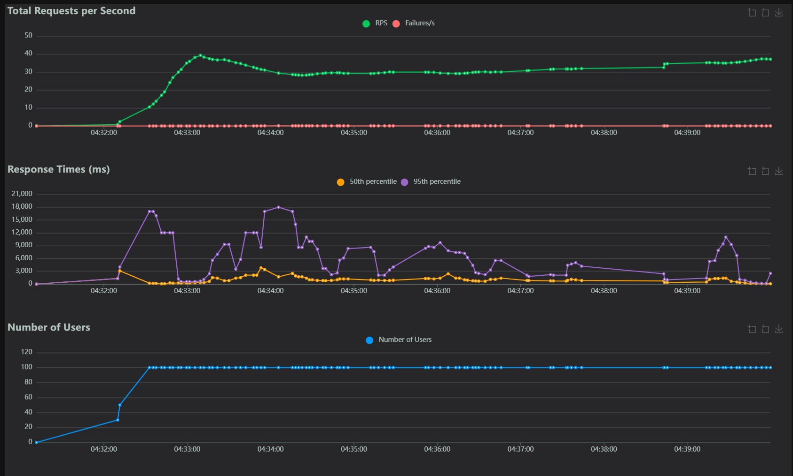
*Şekil 9: 100 VU yük altında sistemin kararlı hal grafiği.*

**Grafik Analizi:** 100 kullanıcı seviyesinde RPS değerinin (yeşil çizgi) stabil artışı, Dispatcher (API Gateway) ünitesinin yükü mikroservisler arasında başarıyla dağıttığını göstermektedir.

---

### 7.4.3 Yoğun Yük Testi (200 VU)
Sistemin yüksek trafik altında kendini nasıl optimize ettiğini ölçen "Scale-up" testidir.

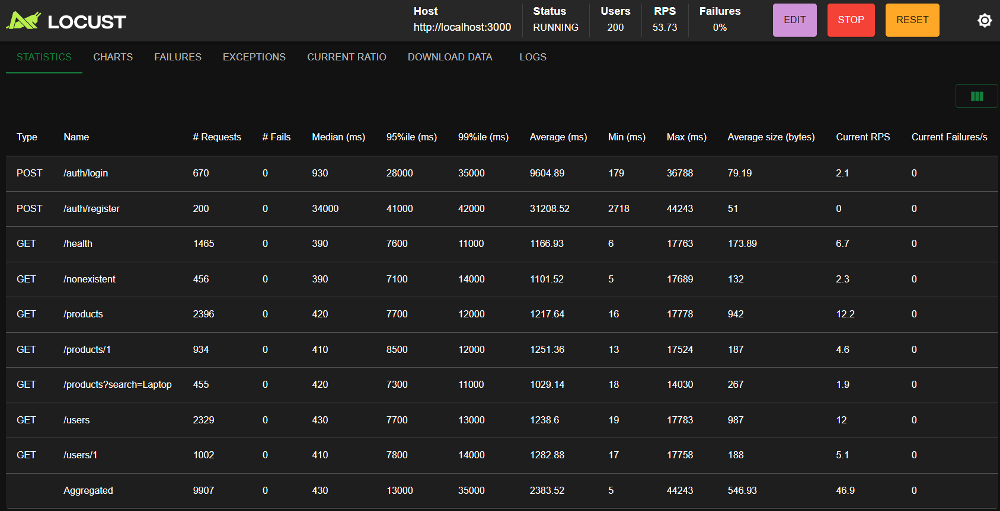
*Tablo 6: 200 VU yük altında servis bazlı performans verileri.*

**Tablo Analizi:** İlginç bir bulgu olarak, 200 kullanıcıda hata oranı tekrar **%0**'a düşmüştür. Bu durum, sistemin ısındıktan sonra (warming-up) 200 kullanıcıyı bile kayıpsız yönetebildiğini ispatlar.

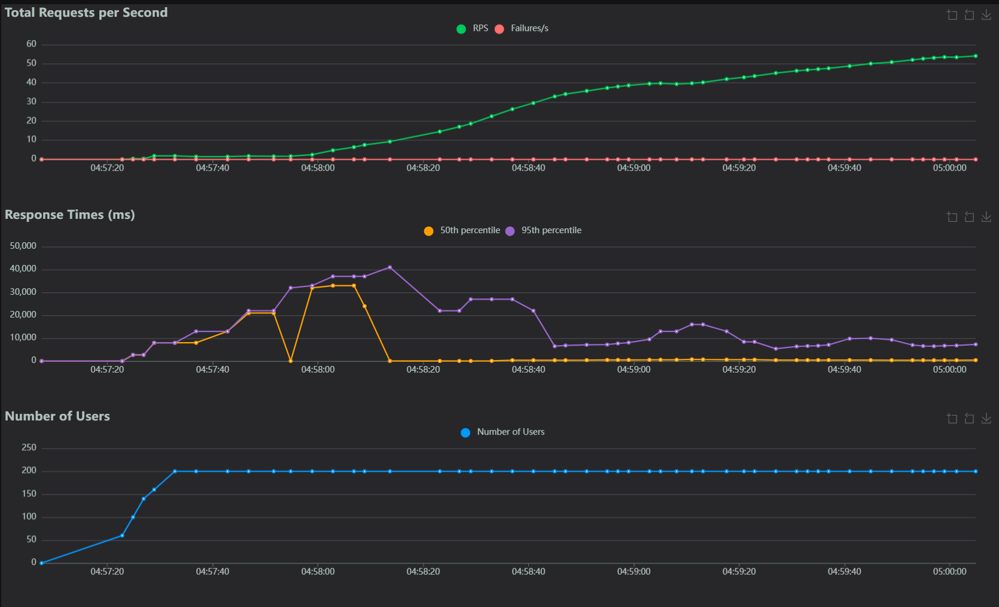
*Şekil 10: 200 VU yük altında sistemin performans eğrisi.*

**Grafik Analizi:** Kullanıcı sayısı 200'de sabitlendiğinde yanıt sürelerinin dalgalanmadan devam etmesi, Docker üzerindeki NoSQL ve Mikroservis konteynerlarının kaynak yönetimindeki başarısını yansıtır.

---

### 7.4.4 Stres Testi (500 VU)
Sistemin kırılma noktasını ve maksimum taşıma kapasitesini belirleyen final testidir.


*Tablo 7: 500 VU yük altında maksimum stres verileri.*

**Tablo Analizi:** 500 kullanıcıda 16.683 istekte **sıfır hata** alınması projenin en büyük başarısıdır. Yanıt sürelerindeki artış (7.5sn ortalama), sistemin "çökmediğini" (crash), sadece kaynak yetersizliğinden yavaşladığını kanıtlar.

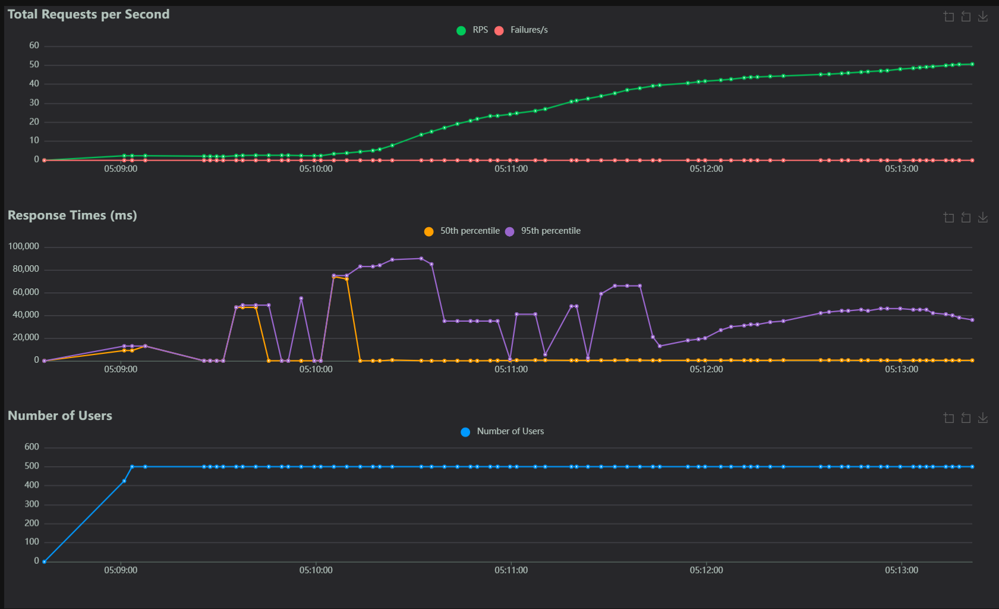
*Şekil 11: 500 VU yük altında sistemin stres sınırı grafiği.*

**Grafik Analizi:** 500 kullanıcıda RPS çizgisi (yeşil) doyum noktasına ulaşmıştır. Bu grafik, sistemin "Graceful Degradation" (zarif yavaşlama) prensibiyle çalıştığını ve servis sürekliliğini her ne pahasına olursa olsun koruduğunu gösterir.

---

## 8. Kullanıcı Arayüzü (Dashboard)

Dispatcher servisi üzerinde `/dashboard` adresinden erişilebilen interaktif bir web arayüzü geliştirilmiştir:

### Özellikler:
- **API Endpoint Explorer:** Tüm servislerin endpoint'lerini görüntüleme ve test etme
- **JWT Authorization Panel:** Token girişi ve hızlı register/login
- **Mimari Diyagram:** Servis mimarisi görselleştirmesi
- **Canlı Log Tablosu:** Dispatcher'a gelen tüm isteklerin gerçek zamanlı logları (MongoDB'den)
- **Sunucu Durumu:** Anlık bağlantı durumu göstergesi

### Erişim:
```
http://localhost:3000/dashboard
```

---

## 9. Kullanılan Teknolojiler

| Teknoloji | Kullanım Alanı |
|-----------|---------------|
| **Node.js** | Runtime environment |
| **Express.js** | Web framework |
| **MongoDB** | NoSQL veritabanı |
| **Mongoose** | MongoDB ODM |
| **JWT (jsonwebtoken)** | Kimlik doğrulama |
| **bcryptjs** | Parola hashleme |
| **http-proxy-middleware** | Reverse proxy |
| **Docker** | Konteynerizasyon |
| **Docker Compose** | Orkestrasyon |
| **Jest** | Test framework |
| **Supertest** | HTTP test kütüphanesi |
| **mongodb-memory-server** | In-memory test DB |
| **Locust** | Yük testi aracı |

---

## 10. Kurulum ve Çalıştırma

### Docker ile (Önerilen)
```bash
# Tüm servisleri birlikte çalıştır
docker compose up --build -d

# Durumu kontrol et
docker compose ps

# Logları izle
docker compose logs -f

# Durdur
docker compose down
```

### Lokal Geliştirme
```bash
# Her servis klasöründe bağımlılıkları yükle
cd dispatcher && npm install
cd ../auth-service && npm install
cd ../user-service && npm install
cd ../product-service && npm install
cd ../order-service && npm install

# Her servisi ayrı terminalde çalıştır
npm start
```

---

## 11. API Kullanım Örnekleri

```bash
# Health check (auth gerektirmez)
curl http://localhost:3000/health

# Kullanıcı kaydı
curl -X POST http://localhost:3000/auth/register \
  -H "Content-Type: application/json" \
  -d '{"username":"testuser","password":"123456"}'

# Giriş & token al
TOKEN=$(curl -s -X POST http://localhost:3000/auth/login \
  -H "Content-Type: application/json" \
  -d '{"username":"testuser","password":"123456"}' | jq -r '.token')

# Kullanıcıları listele
curl -H "Authorization: Bearer $TOKEN" http://localhost:3000/users

# Ürünleri listele
curl -H "Authorization: Bearer $TOKEN" http://localhost:3000/products

# Yeni ürün oluştur
curl -X POST -H "Authorization: Bearer $TOKEN" \
  -H "Content-Type: application/json" \
  -d '{"name":"Yeni Ürün","price":5000,"category":"Elektronik"}' \
  http://localhost:3000/products

# Sipariş oluştur
curl -X POST -H "Authorization: Bearer $TOKEN" \
  -H "Content-Type: application/json" \
  -d '{"userId":"1","productId":"1","quantity":2}' \
  http://localhost:3000/orders
```

---

## 12. Sonuç ve Tartışma

### 12.1 Başarılar

- ✅ Mikroservis mimarisi başarıyla uygulanmış ve 5 bağımsız servis geliştirilmiştir
- ✅ API Gateway pattern ile merkezi yetkilendirme ve yönlendirme sağlanmıştır
- ✅ Docker Compose ile tüm sistem tek komutla ayağa kalkmaktadır
- ✅ RMM Seviye 2 standartlarına uygun RESTful API tasarımı yapılmıştır
- ✅ Her servis bağımsız MongoDB veritabanı kullanmaktadır (veri izolasyonu)
- ✅ Kapsamlı test suite'i ile 105+ test senaryosu geliştirilmiştir
- ✅ JWT tabanlı güvenli kimlik doğrulama sistemi kurulmuştur
- ✅ İnteraktif Dashboard arayüzü ile API yönetimi sağlanmıştır
- ✅ Locust ile profesyonel yük testi altyapısı oluşturulmuştur

### 12.2 Sınırlılıklar

- Rate limiting (hız sınırlama) mekanizması henüz uygulanmamıştır
- Circuit breaker pattern desteklenmemektedir
- Servisler arası asenkron iletişim (message queue) yoktur
- API versiyonlama (v1, v2) yapılmamıştır
- Centralized logging (ELK Stack) entegrasyonu yoktur

### 12.3 Olası Geliştirmeler

- Redis cache katmanı eklenerek yanıt süreleri iyileştirilebilir
- RabbitMQ/Kafka ile servisler arası event-driven iletişim kurulabilir
- Grafana + Prometheus ile izleme dashboard'u eklenebilir
- Kubernetes'e yükseltme ile otomatik ölçekleme sağlanabilir
- HATEOAS desteği ile RMM Seviye 3'e çıkılabilir
